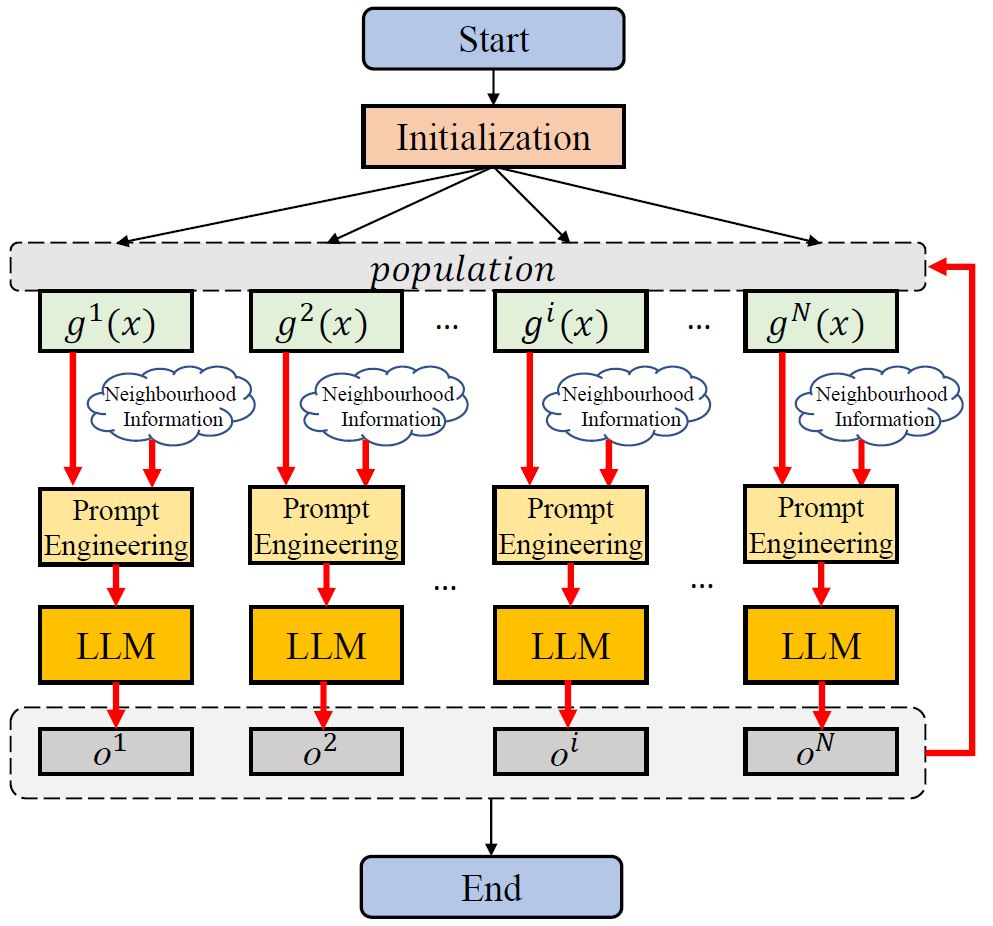
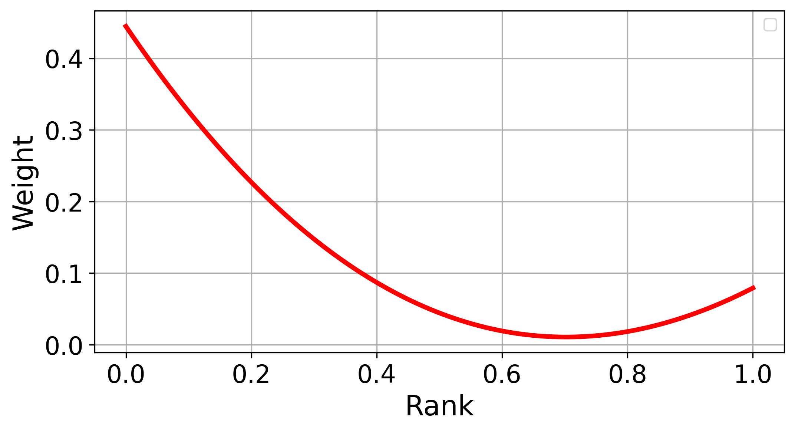

# LLM4MOEA
Large Language Model (LLM) for Multiobjective Evolutionary Algorithm (MOEA)

This Rep consists the implementation of:

+ **MOEA/D-LLM**:  LLM (GPT) serves as a blackbox search operator for decomposition-based MOEA (MOEA/D)
+ **MOEA/D-LO**: learning from the LLM behavior, we further design an explicit white-box operator with randomness and propose a new version of decomposition-based MOEA, termed MOEA/D-LO.

Below is an illustration of the general framework of integrating LLM in MOEA/D, for more information and results please refer to manuscript [LLM4MOEA](https://arxiv.org/abs/2310.12541)

If you find the code helpful, please cite : 
Fei Liu, Xi Lin, Zhenkun Wang, Shunyu Yao, Xialiang Tong, Mingxuan Yuan, and Qingfu Zhang. "Large language model for multi-objective evolutionary optimization." arXiv preprint arXiv:2310.12541 (2023).

[ArXiv paper link](https://arxiv.org/abs/2310.12541)

If you are interested in **LLM for algorithm design**, the following are our recent related works:

+ [Algorithm Evolution using LLM (AEL)](https://arxiv.org/abs/2311.15249)

+ [AEL for designing GLS beating Human](https://arxiv.org/abs/2401.02051)

+ [Attacking using LLM](https://arxiv.org/abs/2401.15335)

# Usage

**MOEA/D-LLM**

Implemented in [Pymoo](https://pymoo.org/) 

**Set your LLM key before start !**

> cd MOEAD-LLM
>
> python run.py

**MOEA/D-LO**

Implemented in [PlatEMO](https://github.com/BIMK/PlatEMO)

copy [MOEAD-LO.m] to fold "Algorithms/Multi-objective optimization/MOEA-D-LO10" in PlatEMO

copy [OperatorLO.m] to fold "Algorithms/Utility functions" in PlatEMO

Test it using PlatEMO GUI or terminal command

# LLM

API for LLM

In our implementation, we use [API2D API](https://api2d.com/) to request response from GPT3.5 

**Step 1:** Create your key from API2D 

**Step 2:** Copy your own API2D API Key to run.py. No additional settings are required.

You can also 

+ Use official API from OpenAI

+ Or local open-source LLM model, such as Llama2, Gemma

# From LLM Results to Linear Operator

> cd LLM2LO
>
> python LinearReg.py
>
> python PolyReg.py

where two regressions are in two levels

+ LinearReg.py  performs linear regression on samples (**X to Y**) from data.txt. 10 weights are produced
+ PolyReg.py performs polynomial regression on weight (**Weight to Rank**). Weights for poly regression are produced

The resulted regression of weight vs. rank should be  as follows (slightly different from the results in manuscript with different random seeds):

